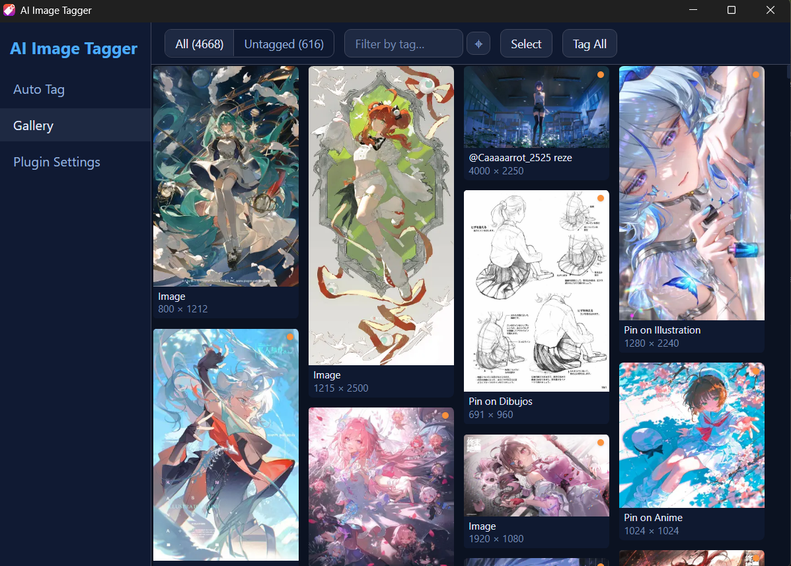
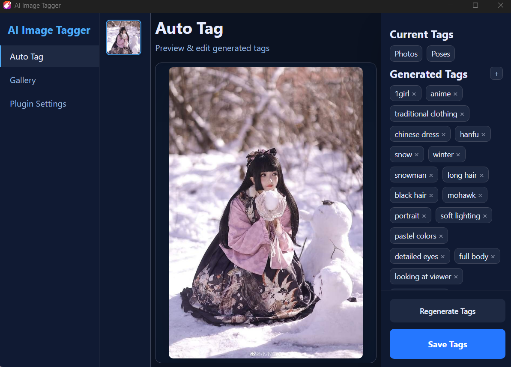
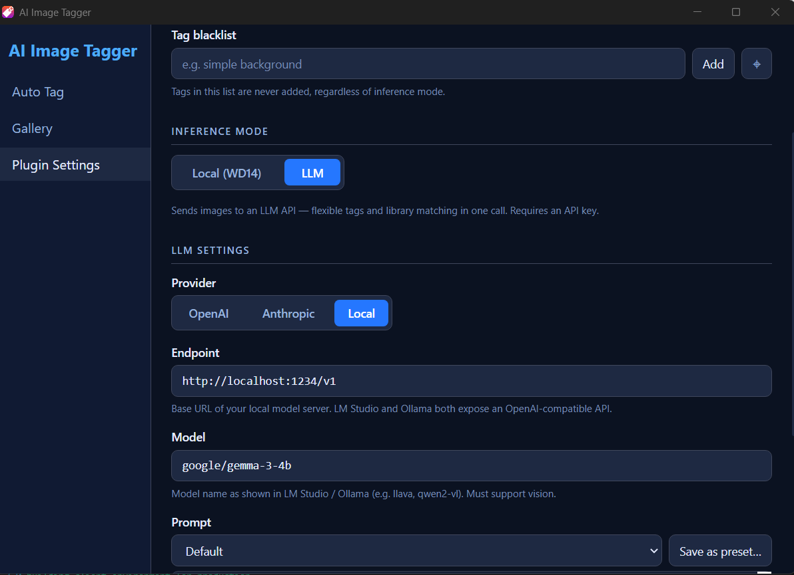

# AI Image Tagger

An [Eagle](https://eagle.cool) plugin that automatically tags images using AI. Supports local WD14 models, CLIP-based tag suggestions, and cloud/local LLMs.



## Motivations
Eage.cool is a tool I have used extensively since learning about it for storing reference and other media. The Eagle team have made it very easy to save media in their application, especially with their browser plugin. However, tagging images is not as simple, especially for a new library without tags or extensive libraries with a lot of tags. The purpose of this plugin is to make the process easier by having AI generate tags that fit the user's needs. During intially development, I used an inference model that didn't require LLMs, named WD14 trained on Danbooru tags as this fitted my personal needs better, but LLM support has been added to make the plugin more powerful.

## Features

- **WD14 local inference** — fast, offline tagging using ONNX models (e.g. wd-v1-4-convnext-tagger-v2)
- **CLIP tag suggestions** — matches your Eagle tag library against image embeddings
- **LLM tagging** — detailed Danbooru-style tags via OpenAI, Anthropic, or any local OpenAI-compatible server (LM Studio, Ollama, etc.)
- **Gallery view** — browse all library images, filter by tag, batch tag with progress
- **Tag blacklist** — globally exclude tags from all inference results
- **Prompt presets** — save and switch between custom LLM prompts
- **Auto-save** — automatically save generated tags without manual confirmation
- **Tag deduplication** — never re-adds tags already saved to an item

## Screenshots

| Single image view | Settings |
|---|---|
|  |  |

## Installation & running

### From source

```bash
# 1. Clone the repo
git clone https://github.com/BarnattW/eagle-ai-image-tagger
cd eagle-ai-image-tagger

# 2. Install dependencies
npm install

# 3. Build the UI
npm run build

# 4. Load in Eagle: Plugins → Developer → Load Unpacked Plugin → select this folder
```

After the initial build you only need to rebuild when you change source files (`npm run build` or `npm run build:watch` for auto-rebuild on save).

### Development workflow

```bash
npm run build:watch   # rebuilds on every file save
```

Reload the plugin in Eagle (right-click plugin → Reload) to pick up changes.

## Setup

### Local mode (WD14)

1. Download a WD14 ONNX model. Recommended: [wd-v1-4-convnext-tagger-v2](https://huggingface.co/SmilingWolf/wd-v1-4-convnext-tagger-v2) — download `model.onnx` and `selected_tags.csv` into the same folder.
2. In Settings > Local, set **WD14 Model Folder** to that folder.
3. Adjust General/Character thresholds and Top N as needed.

### CLIP suggestions (optional)

CLIP ranks your existing Eagle tags by semantic similarity to the image, surfacing relevant ones you've used before.

1. Download a CLIP ONNX model. Recommended: [clip-vit-base-patch32](https://huggingface.co/openai/clip-vit-base-patch32) exported to ONNX — needs `vision_model.onnx` and `text_model.onnx`.
2. In Settings > Local, enable **CLIP Suggestions** and set the model folder.

### LLM mode

Switch inference mode to **LLM** in Settings.

| Provider | What to set |
|---|---|
| OpenAI | API key, optionally a model name (default: `gpt-4o-mini`) |
| Anthropic | API key, optionally a model name (default: `claude-haiku-4-5`) |
| Local | Endpoint URL (default: `http://localhost:1234/v1`), model name |

**Recommended local vision models** (via LM Studio): Tested with Gemma3-4B

> Reasoning models (Qwen3, DeepSeek-R1) are not ideal — their chain-of-thought output consumes context before producing JSON.

## Usage

### Single image

Open the plugin while images are selected in Eagle. The plugin opens in detail view showing the image, generated tags, and any CLIP/library suggestions. Click tag chips to add or remove them, then click **Save Tags**.

### Gallery

Click **Gallery** in the sidebar to browse all library images.

- **Filter**: type a tag and press Enter (or use the picker button) to filter. Multiple tags use AND logic. Remove filters with the x chip or Clear.
- **Select**: click the checkbox on any card, or hold Ctrl/Cmd and click, or use Shift+click for range selection. Click **Select** button to enter persistent select mode.
- **Batch tag**: with items selected, click **Tag Selected**. Or click **Tag All** / **Tag All Untagged** to process the visible filtered set. A progress bar shows current/total with a Cancel button.

### Tag blacklist

In Settings > General, add tags to the blacklist. Blacklisted tags are stripped from all inference results (WD14, CLIP, and LLM) before they are shown or saved.

### Prompt presets

In Settings > LLM, use the prompt dropdown to switch between Default and saved presets. Type a custom prompt, click **Save as preset...** to name and store it. Delete non-default presets with the trash button.